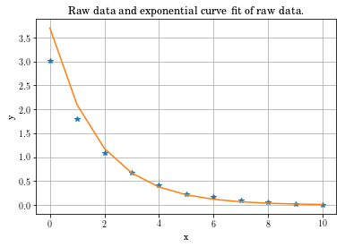

Curve fitting experimental data
###########################################

:date: 2018-Sept-07 15:00 EDT
:tags: Data, Curve fitting, Matlab, Octave
:category: Programming
:slug: data-fitting
:author: Joseph C. Slater
:summary: Curve fitting experimental data
:Status: published

Curve fitting data is a standard practice in creating physical models of
observed phenomena. When an expected model form exists, we use that form
and fit it the best we can. If there is too much error for our needs, we
may ignore the physical model for the sake of expedience. If we have no
physics-based model we are free to use what ever seems to work the best.
Often the solution presented is to plot data, pick two points, then get
a line from that. Picking two points “works”, but it’s crass and defeats
the point of collecting that much data. A much better way is to
transform the data using log functions, find your parameters, and
transform them appropriately from ``log space``.

Fitting a line
==============

Let’s start with a refresher for curve fitting :math:`y=mx+b`. Our
derivation led us to two equations and two unknowns. You may use those.
With a modern computer (under 35 years old), the faster way is to do
this with linear algebra. With Matlab, ``polyfit`` will do this for you.
I will use this later.

With linear algebra, we write the equations such that:

.. math:: y_i = m x_i + b

Putting a bunch of these together, I can write them in matrix form as

.. math::

   \begin{bmatrix}
   y_1\\
   y_2\\
   y_3\\
   y_4\\
   \vdots
   \end{bmatrix}
   =
   \begin{bmatrix}
   x_1& 1\\
   x_2& 1\\
   x_3& 1\\
   x_4& 1\\
   \vdots&\vdots\\
   \end{bmatrix}
   \begin{bmatrix}
   m\\
   b\end{bmatrix}

 which for compactness we write as

.. math:: Y = X B

Because :math:`X` is not square, we can instead pre-multiply by
:math:`X^T` so that the matrix preceding :math:`B` is now square
(specifically, for a line it is now a :math:`2\times 2` matrix).

.. math:: X^TY=X^TXB

Pre-multiplying both sides by :math:`(X^TX)^{-1}` we have

.. math:: (X^TX)^{-1}X^TY=B

The elements of :math:`B` are :math:`m` and :math:`b`. In Matlab, this
would look something like

::

   >> Y = [1;2;3;4]
   Y =
      1
      2
      3
      4
   >> x = [4;3;2;1]
   x =
      4
      3
      2
      1
   >> X = [x*0+1, x]
   X =
      1   4
      1   3
      1   2
      1   1
   >> B = (X'*X)\X'*Y
   B =
      5
     -1

which means a :math:`y` intercept of :math:`5` an a slope of :math:`1`.

We could alternatively have used ``polyfit`` like this:

::

   >> B = polyfit(x, Y,1)
   B =
     -1.0000   5.0000

While this is certainly simpler, and **allowed for the course** it is
limited in its flexibility compared to the detailed method which would
allow you to fit a 2-D surface instead of just a line.

To curve fit a parabola, you follow the same procedure as above, but
starting with :math:`y = a x^2 + b x + c`, or you use ``polyfit`` with
the last parameter set to :math:`2`.

Other forms
-----------

Power function
~~~~~~~~~~~~~~

I covered how to do this in class when you want a model of the form
:math:`y=bx^m`.

Let’s refresh:

Start by taking the natural log of the equation. This yields

.. math:: \ln(y)=\ln(b)+m \ln(x)

For simplicity, you could define :math:`\ln(y)=Y`, :math:`\ln(x)=X`, and
:math:`\ln(b)=B` so that the equation is

.. math:: Y = m X + B

The is the equation of a line. If you use the log of the data :math:`x`
and :math:`y`, and curve fit like you would a line, you obtain :math:`m`
and :math:`\ln(b)`. Since :math:`b=e^{B}=e^{\ln(b)}`, if you can fit a
line, you can get the parameters :math:`b` and :math:`m` for the model
:math:`y=bx^m`.

Exponential function
~~~~~~~~~~~~~~~~~~~~

Let’s start by presuming a model of the form

.. math:: y = b e^{mx}

Start by taking the natural log of the equation. This yields

.. math:: \ln(y)=\ln(b)+m x

For simplicity, you could define :math:`\ln(y)=Y` and :math:`\ln(b)=B`
so that the equation is

.. math:: Y = m x + B

The is the equation of a line. If you use the :math:`\ln` of the data
:math:`y`, and curve fit like you would a line, you obtain :math:`m` and
:math:`\ln(b)`. Since :math:`b=e^{B}=e^{\ln(b)}`, if you can fit a line,
you can get the parameters :math:`b` and :math:`m` for the model
:math:`y=be^{xm}`.

In Matlab, this would look like

::

   x = (0:10)'
   y =[3.0138902;
      1.8036854;
      1.0875830;
      0.6749870;
      0.4167889;
      0.2215530;
      0.1667404;
      0.0906666;
      0.0593329;
      0.0275748;
      0.0046658]
   >> B = polyfit(x, Y, 1)
   B =
     -0.57030   1.30850
   >>> b = exp(B(2))
   b =  3.7006

Here, :math:`1.30850` is not the :math:`y` intercept but instead is the
:math:`\ln` of the coefficient to the exponential (still called
:math:`b`). So the equation is

.. math:: y(x) = 3.7006 e^{(-0.57030 x)}

Most students in engineering schools seem to be using Matlab, so I have
presented the code above in that form. I prefer Python. My blog already
covers why so I won’t repeat that. For this purpose, it is simply easier
for me to generate the plot of the results in python. You can read or
ignore the code at your discretion.

.. code:: ipython3

    %matplotlib inline
    import numpy as np
    import matplotlib.pyplot as plt

.. code:: ipython3

    x = np.linspace(0,10,11)
    y = np.array([3.0138902, 1.8036854, 1.0875830, 0.6749870, 0.4167889, 0.2215530, 0.1667404, 0.0906666, 0.0593329, 0.0275748, 0.0046658])

.. code:: ipython3

    np.polyfit(x,np.log(y), 1)

.. parsed-literal::

    array([-0.5703016 ,  1.30849592])

.. code:: ipython3

    plt.plot(x, y, '*', x, np.exp(1.30849592)*np.exp(-0.5703016*x))
    plt.xlabel('x')
    plt.ylabel('y')
    plt.title('Raw data and exponential curve fit of raw data.')
    plt.grid()

.. .. image:: output_5_0.png

.. _figure1:

   Figure 1: Curve fit to data.
