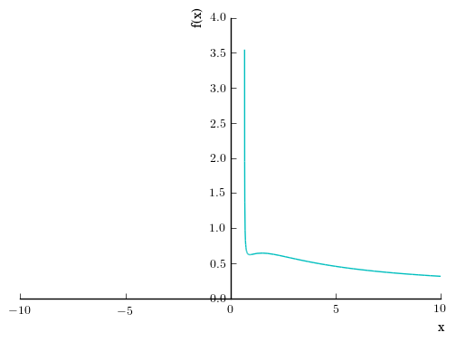

A Quick Introduction to Sympy
#####################################################
:date: 2016-10-25 09:55 EDT
:tags: Python, Sympy, Calculus, Plotting
:category: Research
:slug: sympy-introduction
:author: Joseph C. Slater
:summary: A few quick tips for starting with sympy
:Status: published

This is a quick demo of Sympy, partly for you, but mostly for me. The
`actual
notebook <https://github.com/josephcslater/iPythonExamples/blob/master/SympyDemo.ipynb>`__
is available on my `github iPythonExamples
repository <https://github.com/josephcslater/iPythonExamples>`__.

.. code:: python

    # import symbolic capability to Python
    from sympy import *

.. code:: python

    # print things all pretty
    from sympy.abc import *
    init_printing()

Consider solving the problem

:math:`y = \frac{x^2\sqrt{3x-2}}{(x+1)^2}`, find :math:`\frac{dy}{dx}`

.. code:: python

    # Need to define variables as symbolic for sympy to use them.
    x, y= symbols("x, y", real = True)

.. code:: python

    # Define y
    y = x**2*sqrt(3*x-2)/(x+1)**2
    y # This causes it to output formatted nicely. The print command formats it as computer code

.. math::

    \frac{x^{2} \sqrt{3 x - 2}}{\left(x + 1\right)^{2}}

.. code:: python

    # Taking the natural log of this:
    a = ln(x**2*sqrt(3*x-2)/(x+1)**2)
    a # Keep in mind that the left hand side is ln(y)

.. math::

    \log{\left (\frac{x^{2} \sqrt{3 x - 2}}{\left(x + 1\right)^{2}} \right )}

.. code:: python

    # Taking its derivative with respect to x
    # So, we took the log of the right side, then the derivative
    diff(a,x)

.. math::

    \frac{\left(x + 1\right)^{2}}{x^{2} \sqrt{3 x - 2}} \left(\frac{3 x^{2}}{2 \left(x + 1\right)^{2} \sqrt{3 x - 2}} - \frac{2 x^{2} \sqrt{3 x - 2}}{\left(x + 1\right)^{3}} + \frac{2 x \sqrt{3 x - 2}}{\left(x + 1\right)^{2}}\right)

.. code:: python

    # That is kind of messy. Let the computer simplify it
    simplify(diff(a,x))

.. math::

    \frac{3 x^{2} + 15 x - 8}{2 x \left(3 x^{2} + x - 2\right)}

.. code:: python

    # We could have done this all at once
    simplify(diff(ln(y),x))

.. math::

    \frac{3 x^{2} + 15 x - 8}{2 x \left(3 x^{2} + x - 2\right)}

Now, the left hand side processed the same way is

.. math:: y

take the natural log

.. math:: \ln(y)

Take the derivative

.. math:: \frac{1}{y}dy

So, our entire processed equation is

.. math:: \frac{1}{y}dy = \frac{3 x^{2} + 15 x - 8}{2 x \left(3 x^{2} + x - 2\right)}

so all we have to do is multiply the processed right side by :math:`y`
and we have our answer and our derivative is

.. code:: python

    simplify(diff(ln(y),x)*y)

.. math::

    \frac{x \left(3 x^{2} + 15 x - 8\right)}{2 \sqrt{3 x - 2} \left(x^{3} + 3 x^{2} + 3 x + 1\right)}

Of course, Sympy is capable enough that we can just take the derivative
directly

.. code:: python

    simplify(diff(y,x))

.. math::

    \frac{x \left(3 x^{2} + 15 x - 8\right)}{2 \sqrt{3 x - 2} \left(x^{3} + 3 x^{2} + 3 x + 1\right)}

but that was way too easy.

We could compare them, just to be sure they are the same

.. code:: python

    simplify(diff(y,x))==simplify(diff(ln(y),x)*y)

.. parsed-literal::

    True

Or plot this monstrosity

.. code:: python

    plot((diff(y,x),(x,0.2,10)), (y, (x,0.5,10)))

.. _figure1:

.. code:: python

    # To change colors
    # show = False delays the plot until we can set all of the parameters
    # legend turns on the legend and uses the labels we have later.
    p = plot((diff(y,x),(x,0.2,10)), (y, (x,0.5,10)), show = False, legend = True)
    p[0].line_color = 'blue'
    p[0].label = '$\\frac{dy}{dx}$'
    p[1].line_color = 'green'
    p[1].label = '$y$'
    p.show()

.. _figure2:

.. figure:: images/output_18_0.png
   :width: 50%
   :align: center
   :alt: plot

What if we wanted to make a substitution?

.. code:: python

    y.subs(x,alpha)

.. math::

    \frac{\alpha^{2} \sqrt{3 \alpha - 2}}{\left(\alpha + 1\right)^{2}}
